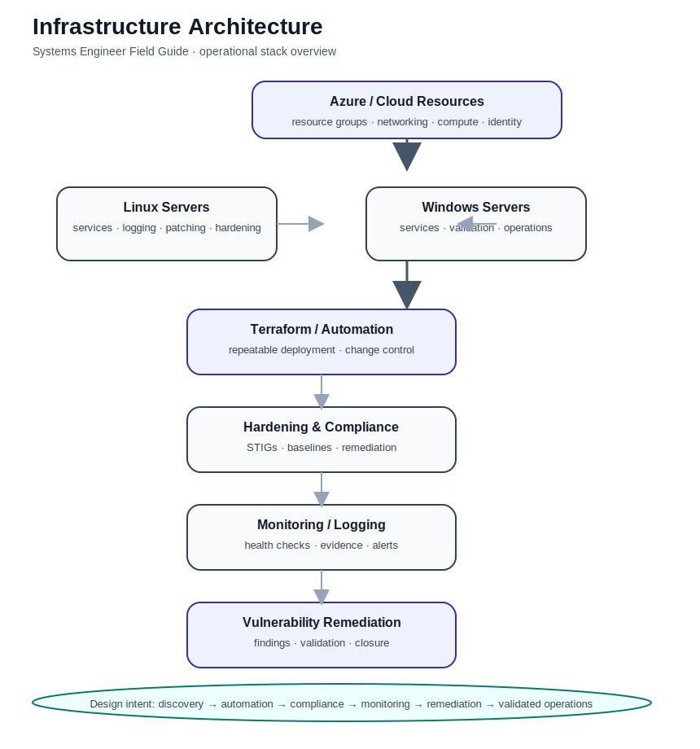
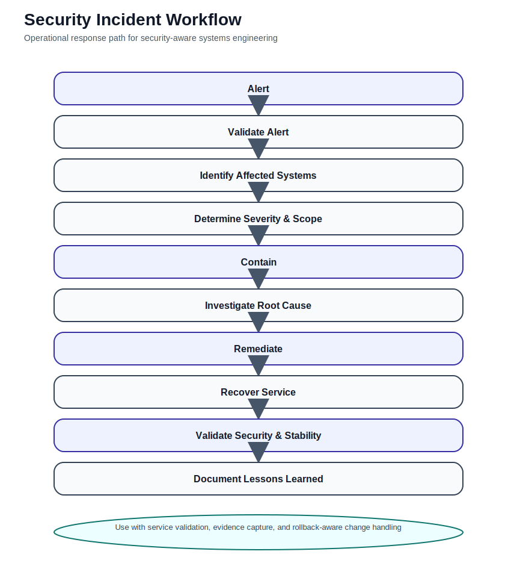

# Systems Engineer Field Guide


## Architecture & Workflow Diagrams

This repository is organized around practical systems engineering workflows used in security-conscious enterprise and government environments.
It combines operational runbooks, security-aware workflows, and infrastructure validation practices into a portfolio-grade systems engineering knowledge base. The diagrams below highlight the core operating model, change-control thinking, and infrastructure lifecycle represented throughout the guide.

### Infrastructure Architecture


This diagram shows the high-level systems stack represented in the repository:
- Azure / cloud resource layer
- Linux and Windows server operations
- Terraform automation and repeatable deployment
- STIG hardening and compliance alignment
- monitoring, logging, and validation
- vulnerability remediation and closure workflows

---

### Security Incident Workflow


This workflow visualizes how operational engineering and security response intersect:
- alert validation
- affected system identification
- severity and scope determination
- containment and root cause investigation
- remediation and service recovery
- security and stability validation
- lessons learned and evidence capture

---

### Terraform Deployment Flow


This diagram shows a disciplined infrastructure-as-code path:
- author or update Terraform code
- format and validate configuration
- review `terraform plan`
- approve changes
- apply safely
- validate resources after deployment
- confirm state and drift posture

## Engineering Domains Covered

• Linux systems administration  
• Azure cloud infrastructure  
• Terraform infrastructure-as-code  
• STIG hardening and compliance  
• vulnerability remediation  
• monitoring and logging  
• infrastructure troubleshooting  
• operational runbooks and playbooks  

## Engineering Domains Covered

• Linux systems administration  
• Azure cloud infrastructure  
• Terraform infrastructure-as-code  
• STIG hardening and compliance  
• vulnerability remediation  
• monitoring and logging  
• infrastructure troubleshooting  
• operational runbooks and playbooks

A portfolio-grade systems engineering handbook focused on:

• Linux administration\
• Azure infrastructure\
• Terraform infrastructure-as-code\
• STIG hardening\
• server upgrades and patch validation\
• vulnerability remediation\
• operational troubleshooting\
• security-aware infrastructure support

------------------------------------------------------------------------

## What This Project Demonstrates

This repository showcases:

• structured systems thinking  
• security-aware systems administration  
• production-minded troubleshooting discipline  
• operational workflows and validation habits  
• infrastructure automation mindset  
• compliance-aware engineering practices  
• documentation maturity expected in enterprise and government environments  

---

## Real-World Skills Demonstrated

This repository demonstrates practical infrastructure engineering skills used in enterprise and government environments:

• diagnosing infrastructure failures  
• troubleshooting Linux services  
• validating Terraform deployments  
• implementing STIG hardening  
• responding to infrastructure security incidents  
• performing vulnerability remediation workflows  
• documenting repeatable troubleshooting playbooks  
• building operational runbooks and reference documentation  

------------------------------------------------------------------------

## Who This Guide Is For

This repository is designed for:

• Systems Engineers\
• Systems Administrators\
• Infrastructure Engineers\
• Platform / Operations Engineers\
• Security-minded administrators supporting hardened environments

------------------------------------------------------------------------
## Start Here

Use this reading path to get the most value from the repository:

1. Systems Engineer Operational Model  
2. Real Infrastructure Scenarios  
3. Troubleshooting Playbooks  
4. Example Command Reference  
5. Security Incident Workflow  
6. Operational Metrics  
7. Infrastructure Architecture  
8. Case Studies  
9. Lab Walkthroughs  
10. Systems Engineer Cheat Sheet  
------------------------------------------------------------------------

## Key Engineering Sections

### Operational Foundations

• [Systems Engineer Operational Model](docs/MASTER_OUTLINE.md)\
• [Change Validation Workflow](docs/workflows/change-validation-workflow.md)\
• [Infrastructure Architecture Overview](docs/architecture/infrastructure-architecture-overview.md)

### Real-World Operations

• [Real Infrastructure Scenarios](docs/scenarios/README.md)\
• [Troubleshooting Playbooks](docs/playbooks/README.md)\
• [Systems Engineer Command Reference](docs/reference/systems-engineer-command-reference.md)

### Security and Compliance

• [Security Incident Workflow](docs/workflows/security-incident-workflow.md)\
• [Engineering Metrics](docs/metrics/engineering-metrics.md)\
• [Operational Metrics Scorecard Template](docs/metrics/operational-metrics-scorecard-template.md)

### Portfolio Evidence

• [Case Studies](docs/case-studies/)\
• [Lab Walkthroughs](docs/labs/README.md)\
• [Automation Script Documentation](docs/scripts/)\
• [Systems Engineer Cheat Sheet](docs/components/11-daily-30-minute-practice-routine.md)

------------------------------------------------------------------------
## Repository Structure

```text
.github/
└── ISSUE_TEMPLATE/        # issue templates for repo management

assets/                    # screenshots, graphics, and supporting visuals

diagrams/
└── placeholders/          # planned visual assets to convert into polished diagrams

docs/
├── architecture/          # infrastructure and systems design guidance
├── case-studies/          # portfolio-grade implementation writeups
├── labs/                  # hands-on practice walkthroughs
├── metrics/               # operational measurement guidance
├── playbooks/             # repeatable troubleshooting procedures
├── reference/             # quick reference and command guides
├── scenarios/             # real-world issue simulations
├── scripts/               # documentation for repo automation scripts
└── workflows/             # lifecycle, validation, and security workflows

labs/
planning/
releases/
scripts/
terraform/
tools/

README.md
ROADMAP.md
PROJECT_BOARD.md
LICENSE
CONTRIBUTING.md
```

------------------------------------------------------------------------

## Featured Workflow Areas

This field guide is organized around a practical systems engineering lifecycle:

```text
Infrastructure Discovery
        ↓
Documentation
        ↓
Hardening & Compliance
        ↓
Automation
        ↓
Monitoring & Logging
        ↓
Vulnerability Remediation
        ↓
Validation & Continuous Improvement
```

------------------------------------------------------------------------

## Recommended Sections to Review First

If you are evaluating this repository quickly, start with:

• [Systems Engineer Operational Model](docs/MASTER_OUTLINE.md)\
• [Security Incident Workflow](docs/workflows/security-incident-workflow.md)\
• [Infrastructure Architecture Overview](docs/architecture/infrastructure-architecture-overview.md)\
• [Azure VM Fails to Deploy scenario](docs/scenarios/azure-vm-fails-to-deploy.md)\
• [SSH Access Failure playbook](docs/playbooks/ssh-access-failure.md)\
• [STIG Remediation case study](docs/case-studies/stig-remediation-project.md)\
• [Terraform Deployment Standardization case study](docs/case-studies/terraform-deployment-standardization.md)

------------------------------------------------------------------------

## Why This Repository Exists

This project demonstrates how a systems engineer should think and
operate in mixed infrastructure environments where:

• reliability matters\
• security matters\
• documentation matters\
• repeatability matters

It reflects:

• first-90-days ramp-up thinking\
• operational troubleshooting discipline\
• security-conscious systems administration\
• infrastructure-as-code awareness\
• validation-first change management\
• portfolio-quality engineering documentation

------------------------------------------------------------------------

## Roadmap

Future improvements planned:

• polished architecture diagrams\
• improved case studies\
• deeper operational labs\
• enhanced workflow visualizations\
• automation improvements

------------------------------------------------------------------------

## Author

Brian Hannigan  
Cybersecurity Engineer & Systems Architect  

GitHub: https://github.com/brianhannigan  
Repository: https://github.com/brianhannigan/systems-engineer-field-guide

------------------------------------------------------------------------

## License

MIT License
